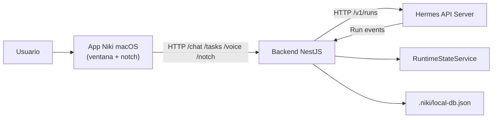

# Arquitectura del Sistema

## Tipo de arquitectura

Niki utiliza una arquitectura **cliente-servidor** con separacion por capas:

- **Clientes:** app macOS Niki (proceso único que gestiona ventana principal + overlay del notch).
- **Backend:** API NestJS que actua como BFF y wrapper del runtime.
- **Runtime de IA:** Hermes API Server, consumido por el backend.
- **Persistencia local:** memoria del proceso y archivo JSON para datos locales.

Tambien se aplica una organizacion modular en backend, similar a una arquitectura por dominios: identidad, runtime, tareas, memoria, voz y wrapper.

## Componentes principales

### Backend

Ubicacion: `app/backend/`

Responsabilidades:

- Exponer endpoints HTTP para los clientes.
- Autenticar solicitudes mediante API key y token.
- Proxy de chat hacia Hermes.
- Emitir eventos de runtime por SSE.
- Gestionar work items, memoria, actividades y voz.
- Mantener estado local del sistema.

### App macOS (Niki)

Ubicacion: `app/Niki/` — proceso unico que unifica la ventana principal y el overlay del notch.

- Sources del notch: `app/Niki/Sources/Notch/`
- Sources del escritorio: `app/Niki/Sources/Desktop/`

Responsabilidades:

- Ofrecer experiencia nativa en SwiftUI.
- Gestionar chat, tareas, voz y settings desde macOS.
- Mostrar interfaz rapida en el notch del Mac.
- Enviar prompts al backend y consumir respuestas.

### Agente local y control de la computadora

Ubicacion: `app/backend/src/modules/runtime/groq-agent.service.ts` y
`app/backend/src/modules/computer/`.

Responsabilidades:

- Ejecutar un agente local con Groq (function-calling) sin depender de Hermes.
- Exponer herramientas que controlan la Mac: shell, AppleScript/JXA, capturas, mouse,
  teclado, apps, archivos, portapapeles y sistema.
- Aplicar una capa de seguridad: niveles de riesgo, modos (`open`/`guarded`/`locked`),
  denylist de comandos destructivos, limites de rutas, timeouts y auditoria.
- Un helper nativo en Swift (`native/niki-input`, CGEvent) ejecuta mouse y teclado.

### Hermes Runtime

Servicio externo/local, proveedor alterno del backend.

Responsabilidades:

- Ejecutar el modelo o agente.
- Responder a requests de chat.
- Emitir eventos de ejecucion.

## Comunicacion entre componentes

## Flujo de chat

1. El usuario escribe un mensaje en la ventana principal o en el overlay del notch.
2. El cliente envia la solicitud al backend.
3. El backend valida autorizacion.
4. El backend envia el prompt a Hermes mediante `/chat/stream`.
5. Hermes responde en streaming.
6. El backend reenvia el stream al cliente.
7. El cliente renderiza la respuesta y actualiza el estado visual.

## Flujo de control de la computadora (agente local)

1. El cliente envia un turno por `POST /chat/stream`.
2. El backend selecciona el proveedor: `groq-local` si `GROQ_API_KEY` esta presente.
3. El agente (Groq) decide y solicita herramientas (function-calling).
4. `ComputerControlService` valida riesgo/modo y ejecuta la accion en la Mac.
5. El resultado vuelve al modelo, que continua hasta resolver la tarea.
6. El texto se transmite por SSE y los eventos de herramienta por `/runtime/events`.
7. Cada accion queda auditada y disponible en `GET /computer/recent`.

## Flujo de tareas

1. El cliente solicita tareas mediante `GET /v1/work-items`.
2. El backend lee los work items desde el servicio de estado/local DB.
3. El usuario puede crear, editar, completar o eliminar tareas.
4. El backend persiste los cambios en `.niki/local-db.json`.

## Flujo del overlay del notch

El overlay del notch forma parte del mismo proceso que la ventana principal (app Niki).

1. El usuario activa el overlay desde el notch.
2. La app Niki (proceso unico) gestiona la interaccion directamente.
3. Los prompts del notch se envian a `POST /notch/debug`.
4. La app consume solicitudes con `POST /notch/consume`.

