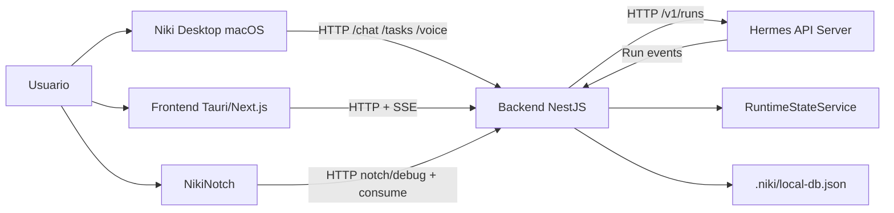

# Arquitectura del Sistema

## Tipo de arquitectura

Niki utiliza una arquitectura **cliente-servidor** con separacion por capas:

- **Clientes:** frontend Tauri/Next.js, app nativa macOS y NikiNotch.
- **Backend:** API NestJS que actua como BFF y wrapper del runtime.
- **Runtime de IA:** Hermes API Server, consumido por el backend.
- **Persistencia local:** memoria del proceso y archivo JSON para datos locales.

Tambien se aplica una organizacion modular en backend, similar a una arquitectura por dominios: identidad, runtime, tareas, memoria, voz y wrapper.

## Componentes principales

### Frontend web y Tauri

Ubicacion: `frontend/`

Responsabilidades:

- Renderizar la experiencia principal de Niki.
- Consumir la API wrapper del backend.
- Mostrar chat, tareas, settings y estado del runtime.
- En modo Tauri, empaquetar la app web como aplicacion de escritorio.

### Backend

Ubicacion: `backend/`

Responsabilidades:

- Exponer endpoints HTTP para los clientes.
- Autenticar solicitudes mediante API key y token.
- Proxy de chat hacia Hermes.
- Emitir eventos de runtime por SSE.
- Gestionar work items, memoria, actividades y voz.
- Mantener estado local del sistema.

### App nativa macOS

Ubicacion: `macOs-app/`

Responsabilidades:

- Ofrecer una experiencia nativa en SwiftUI.
- Gestionar chat, tareas, voz y settings desde macOS.
- Sincronizar configuracion local con NikiNotch.
- Abrir y cerrar NikiNotch como companion app.

### NikiNotch

Ubicacion: `NikiNotch/`

Responsabilidades:

- Mostrar una interfaz rapida en el notch.
- Enviar prompts al backend.
- Consumir respuestas del backend.
- Leer configuracion local desde `~/.niki/notch-config.json`.

### Agente local y control de la computadora

Ubicacion: `backend/src/modules/runtime/groq-agent.service.ts` y
`backend/src/modules/computer/`.

Responsabilidades:

- Ejecutar un agente local con Groq (function-calling) sin depender de Hermes.
- Exponer herramientas que controlan la Mac: shell, AppleScript/JXA, capturas, mouse,
  teclado, apps, archivos, portapapeles y sistema.
- Aplicar una capa de seguridad: niveles de riesgo, modos (`open`/`guarded`/`locked`),
  denylist de comandos destructivos, limites de rutas, timeouts y auditoria.
- Un helper nativo en Swift (`native/niki-input`, CGEvent) ejecuta mouse y teclado.

### Hermes Runtime

Servicio externo/local, proveedor alterno del backend.

Responsabilidades:

- Ejecutar el modelo o agente.
- Responder a requests de chat.
- Emitir eventos de ejecucion.

## Comunicacion entre componentes

## Flujo de chat

1. El usuario escribe un mensaje en la app web, app nativa o notch.
2. El cliente envia la solicitud al backend.
3. El backend valida autorizacion.
4. El backend envia el prompt a Hermes mediante `/chat/stream`.
5. Hermes responde en streaming.
6. El backend reenvia el stream al cliente.
7. El cliente renderiza la respuesta y actualiza el estado visual.

## Flujo de control de la computadora (agente local)

1. El cliente envia un turno por `POST /chat/stream`.
2. El backend selecciona el proveedor: `groq-local` si `GROQ_API_KEY` esta presente.
3. El agente (Groq) decide y solicita herramientas (function-calling).
4. `ComputerControlService` valida riesgo/modo y ejecuta la accion en la Mac.
5. El resultado vuelve al modelo, que continua hasta resolver la tarea.
6. El texto se transmite por SSE y los eventos de herramienta por `/runtime/events`.
7. Cada accion queda auditada y disponible en `GET /computer/recent`.

## Flujo de tareas

1. El cliente solicita tareas mediante `GET /v1/work-items`.
2. El backend lee los work items desde el servicio de estado/local DB.
3. El usuario puede crear, editar, completar o eliminar tareas.
4. El backend persiste los cambios en `.niki/local-db.json`.

## Flujo de NikiNotch

1. Niki Desktop escribe `~/.niki/notch-config.json`.
2. Niki Desktop abre NikiNotch.
3. NikiNotch lee la configuracion local.
4. Los prompts del notch se envian a `POST /notch/debug`.
5. La app consume solicitudes con `POST /notch/consume`.

