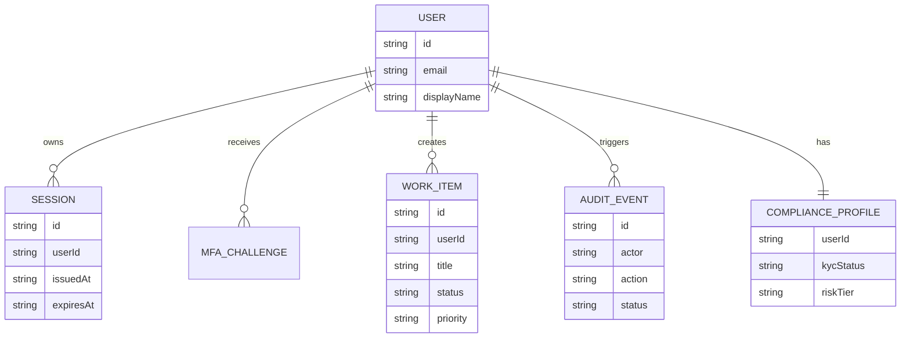

# Diseno de Base de Datos

## Modelo de persistencia actual

El sistema no utiliza una base de datos SQL tradicional en esta etapa. La persistencia principal se divide en:

- **Estado en memoria:** manejado por `RuntimeStateService`.
- **Archivo JSON local:** manejado por `LocalDbService` en `backend/.niki/local-db.json`.
- **Memoria opcional externa:** `UserMemoryService` puede usar almacenamiento externo si se configura.

Esta decision permite desarrollar y probar el sistema localmente sin depender de infraestructura adicional.

## Entidades principales

Aunque no existen tablas SQL fisicas, el dominio esta modelado con entidades equivalentes a tablas.

### users

Representa al usuario del sistema.

Campos principales:

- `id`
- `email`
- `displayName`
- `roles`
- `jurisdiction`
- `accountStatus`
- `walletAddress`
- `createdAt`

### sessions

Representa sesiones autenticadas.

Campos principales:

- `id`
- `userId`
- `issuedAt`
- `expiresAt`
- `mfaVerified`
- `scopes`

### mfa_challenges

Representa retos de verificacion MFA.

Campos principales:

- `id`
- `userId`
- `method`
- `code`
- `expiresAt`
- `status`

### work_items

Representa tareas o elementos de trabajo.

Campos principales:

- `id`
- `userId`
- `kind`
- `title`
- `notes`
- `category`
- `status`
- `priority`
- `dueAt`
- `subtasks`
- `proposalStatus`
- `sourceSessionId`
- `source`
- `createdAt`
- `updatedAt`

### audit_events

Representa eventos de auditoria.

Campos principales:

- `id`
- `ts`
- `actor`
- `action`
- `subject`
- `status`
- `correlationId`
- `detail`

### compliance_profiles

Representa el estado de cumplimiento del usuario.

Campos principales:

- `userId`
- `kycStatus`
- `screeningStatus`
- `jurisdictionAllowed`
- `riskTier`
- `updatedAt`

## Relaciones entre entidades



## Justificacion del diseno

El diseno actual prioriza simplicidad y velocidad de desarrollo:

- Permite ejecutar el sistema sin configurar una base de datos externa.
- Facilita pruebas locales y demos.
- Mantiene el dominio tipado en TypeScript.
- Permite migrar posteriormente a PostgreSQL, SQLite o Supabase sin redisenar todas las entidades.

## Fragmento actual de persistencia

El archivo local usado por `LocalDbService` tiene esta forma:

```json
{
  "workItems": []
}
```

Ejemplo de work item:

```json
{
  "id": "work_123",
  "userId": "user-demo",
  "kind": "task",
  "title": "Preparar entrega del proyecto",
  "notes": "Completar documentacion y revisar ejecucion.",
  "category": "general",
  "status": "open",
  "priority": "medium",
  "subtasks": [],
  "proposalStatus": "none",
  "source": "manual",
  "createdAt": "2026-05-19T00:00:00.000Z",
  "updatedAt": "2026-05-19T00:00:00.000Z"
}
```

## Posible script SQL futuro

Si el proyecto migra a SQL, una tabla inicial para tareas podria ser:

```sql
CREATE TABLE work_items (
  id TEXT PRIMARY KEY,
  user_id TEXT NOT NULL,
  kind TEXT NOT NULL DEFAULT 'task',
  title TEXT NOT NULL,
  notes TEXT,
  category TEXT NOT NULL DEFAULT 'general',
  status TEXT NOT NULL DEFAULT 'open',
  priority TEXT NOT NULL DEFAULT 'medium',
  due_at TEXT,
  subtasks JSONB NOT NULL DEFAULT '[]',
  proposal_status TEXT NOT NULL DEFAULT 'none',
  source_session_id TEXT,
  source TEXT NOT NULL DEFAULT 'manual',
  created_at TEXT NOT NULL,
  updated_at TEXT NOT NULL
);
```

